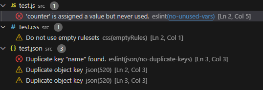
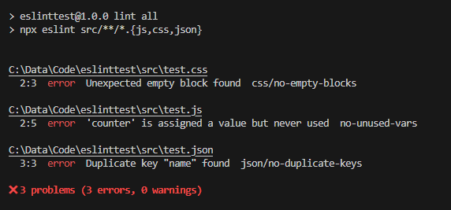

# Multi language linting

This project contains an ESLint setup that lints multiple languages: JS, CSS and JSON.

Test files that have intentional violations to test linting are in the _src_ directory.

## Usage

When you have the ESLint extension installed in VS Code, the linting violations will show in the _Problems_ tab.

Alternatively, you can run linting in the CLI via the following scripts:

- lint js
- lint css
- lint json
- lint all

