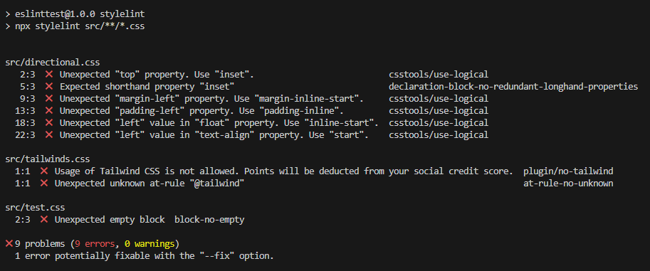

# Multi language linting

This project contains an ESLint setup that lints multiple languages: JS, CSS and JSON.

Test files that have intentional violations to test linting are in the _src_ directory.

## Usage

When you have the ESLint extension installed in VS Code, the linting violations will show in the _Problems_ tab.

Alternatively, you can run linting in the CLI via the following scripts:

- lint js
- lint css
- lint json
- lint all

## Stylelint

The project also contains a stylelint setup so that CSS linting can be done both via ESlint and Stylelint. Two custom rules have been implemented on top of the recommended ones:

- Only allow for logical properties, so not rules like 'margin-left'
- Disallow usage of Tailwind.

Stylelint violations will be visible in the _Problems_ tab when the Stylelint extension is installed:

Alternatively, you can run linting in the CLI via the following script:

- stylelint

